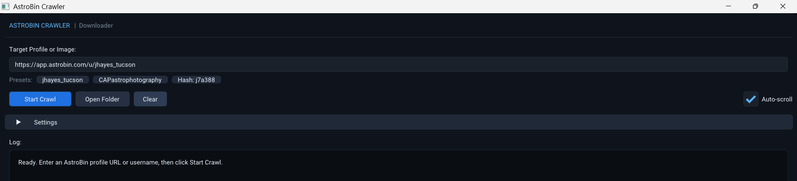
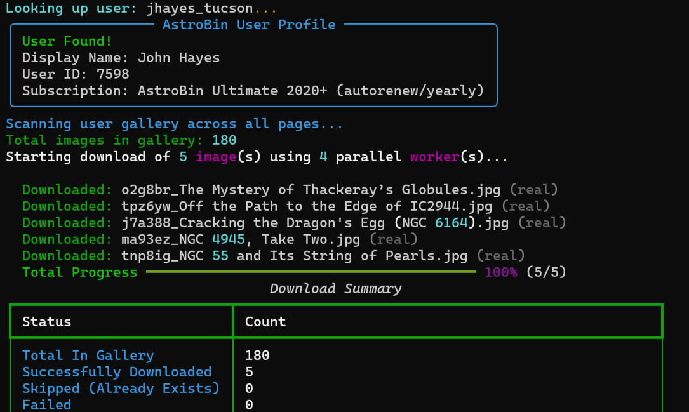

# AstroBin Image Crawler

Image crawler to download full-resolution astrophotography images from any user profile or gallery on [AstroBin](https://app.astrobin.com).


*"Gem Cluster" by Capturing Ancient Photons*

---

[`@jhayes_tucson`](https://app.astrobin.com/u/jhayes_tucson#gallery) [`@CAPastrophotography`](https://app.astrobin.com/u/CAPastrophotography#gallery) 

API: https://welcome.astrobin.com/application-programming-interface

---

## Desktop GUI



[Download](https://github.com/sea-surf/astro/releases/)

---

## Terminal



### Run

```bash
# profile URL
uv run python main.py https://app.astrobin.com/u/jhayes_tucson

# AstroBin URL
uv run python main.py https://www.astrobin.com/users/jhayes_tucson/

# username
uv run python main.py jhayes_tucson

uv run python main.py https://app.astrobin.com/u/jhayes_tucson --workers 8

uv run python main.py https://app.astrobin.com/u/jhayes_tucson --limit 5

uv run python main.py "https://app.astrobin.com/u/jhayes_tucson?i=j7a388" --gallery

uv run python main.py https://app.astrobin.com/u/jhayes_tucson --include-revisions --save-metadata
```

---

## CLI

| Flag | Long Option | Description | Default |
|---|---|---|---|
| `target` | | AstroBin profile URL, image URL, username, or hash | `jhayes_tucson` |
| `-o` | `--output-dir` | Directory where downloaded images are saved | `imgs/` |
| `-w` | `--workers` | Number of concurrent download worker threads | `4` |
| `-l` | `--limit` | Maximum number of images to download from a gallery | Unlimited |
| `-d` | `--delay` | Polite delay between requests in seconds | `0.1` |
| `-r` | `--include-revisions` | Download all revisions (A, B, C...) in addition to original | `False` |
| `-m` | `--save-metadata` | Save image metadata as companion `.json` files | `False` |
| `-g` | `--gallery` | Force gallery crawling even if given a `?i=` image link | `False` |
| | `--overwrite` | Overwrite existing files instead of resuming/skipping | `False` |

