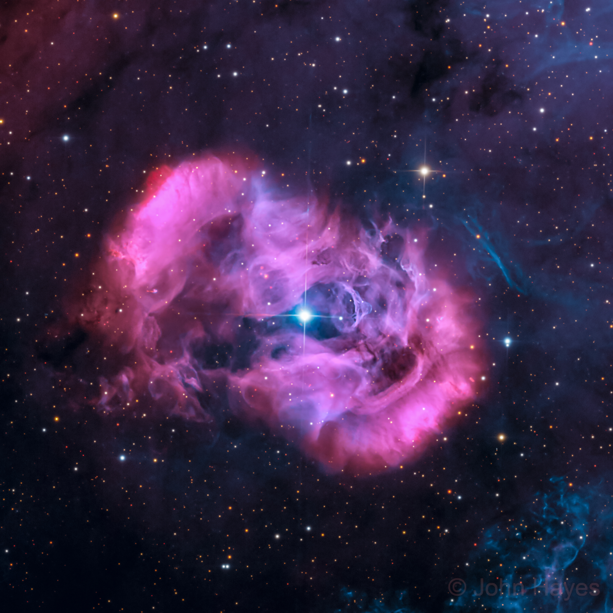

# AstroBin Image Crawler 🌌

A fast, multithreaded Python crawler and downloader designed to recursively download **full-resolution** master astrophotography images from **any user profile or gallery** on [AstroBin](https://app.astrobin.com).


*Sample full-resolution image crawled: "Cracking the Dragon's Egg (NGC 6164)" by John Hayes (3320 × 3320 px, 5.89 MB)*

---

[`@jhayes_tucson`](https://app.astrobin.com/u/jhayes_tucson#gallery) [`@CAPastrophotography`](https://app.astrobin.com/u/CAPastrophotography#gallery) 

---

## Installation

This project is configured for [`uv`](https://github.com/astral-sh/uv), but standard `pip` can also be used.

### With `uv` (Recommended)
```bash
# Run directly (uv automatically manages the environment and dependencies)
uv run python main.py <target>
```

### With `pip`
```bash
python -m venv .venv
# Windows:
.venv\Scripts\activate
# Linux/macOS:
source .venv/bin/activate

pip install -r requirements.txt
```

---

## Usage

### 1. Crawl Any User Profile
Point the crawler to any user's profile URL or username to download their complete gallery:

```bash
# Using a profile URL
uv run python main.py https://app.astrobin.com/u/jhayes_tucson

# Using a classic AstroBin URL
uv run python main.py https://www.astrobin.com/users/jhayes_tucson/

# Or using just the username
uv run python main.py jhayes_tucson
```

### 2. High-Speed Concurrent Crawling
Speed up large galleries with multiple worker threads:

```bash
uv run python main.py https://app.astrobin.com/u/jhayes_tucson --workers 8
```

### 3. Test Crawling with a Limit
Download only the first $N$ images from a profile:

```bash
uv run python main.py https://app.astrobin.com/u/jhayes_tucson --limit 5
```

### 4. Download a Single Image
Download a single image by passing its gallery link, direct URL, or hash:

```bash
# Link copied from profile gallery view
uv run python main.py "https://app.astrobin.com/u/jhayes_tucson?i=j7a388"

# Direct image page
uv run python main.py https://app.astrobin.com/i/j7a388

# Direct hash
uv run python main.py j7a388
```

### 5. Crawl Full Gallery from an Image Link
If you found an image link and want to grab the author's entire gallery:

```bash
uv run python main.py "https://app.astrobin.com/u/jhayes_tucson?i=j7a388" --gallery
```

### 6. Include All Revisions & Export Metadata
Download all uploaded revisions (A, B, C...) and save full technical equipment metadata:

```bash
uv run python main.py https://app.astrobin.com/u/jhayes_tucson --include-revisions --save-metadata
```

---

## CLI Options Reference

| Flag | Long Option | Description | Default |
|---|---|---|---|
| `target` | (positional) | AstroBin profile URL, image URL, username, or hash | `jhayes_tucson` |
| `-o` | `--output-dir` | Directory where downloaded images are saved | `imgs/` |
| `-w` | `--workers` | Number of concurrent download worker threads | `4` |
| `-l` | `--limit` | Maximum number of images to download from a gallery | Unlimited |
| `-d` | `--delay` | Polite delay between requests in seconds | `0.1` |
| `-r` | `--include-revisions` | Download all revisions (A, B, C...) in addition to original | `False` |
| `-m` | `--save-metadata` | Save image metadata as companion `.json` files | `False` |
| `-g` | `--gallery` | Force gallery crawling even if given a `?i=` image link | `False` |
| | `--overwrite` | Overwrite existing files instead of resuming/skipping | `False` |

---
